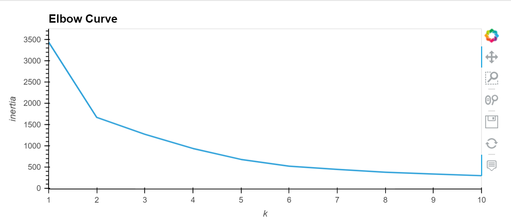

# Final_Project_Farida_work
## Machine Learning of Stock Analysis
### **Preliminary work**

1. I pulled the ipynb file, **Stock_data_creation_David_rev.ipynb** from GitHub. I ran the Python file and generated the csv file, *Combined_stock.csv*. It contained the Yahoo Finance stock data gathered by Luke. The data is cleaned by David. We are currently planning to use nine stock data from Dec 1, 2020 until April 30, 2021. We currently have six stocks from three categories, (1) Income: MSFT, AXP, COIN (this stock is very new. Nick will replace this with Disney stock) - I am still waiting to get these stock data. Nick had issues with pushing files in GitHub branch. (We need to work on this). (2) Growth stock: MARA, SONY and EA (?), (3) Meme stock: AMC and GME and (4) Index fund: VOO.

2. The data in the *Combined_stock.csv* contained six stock data collected by Luke: MARA, SONY, EA, AMC, GME and VOO. After David cleaned the data, there and combined all the stock data, we hae 618 rows and 10 rows. (See Fig 1 below)

**Fig 1:** The image of the DataFrame of the dataset as the starting point of the machine learning.

### **Machine Learning Strategy** 

1. **Issues we faced -** The topic of the project needed to be adjusted to match the scope of the project we can handle. We wanted to follow the social media influence on the stock market. The interest came from the volatility of Gamestop stock in January, 2021. However, it is too complicated to do the *NLP* (Natural Language Processing) from the gathered social media data for different stocks. We found some social sentiment data from Kaggle about GME. We put that aside. We decided to follow the stock trend of the stocks listed above. 

2. **Analysis using Machine Learning -** I thought about supervised machine learning at first. However, it did not seem to match what we want to answer (I am still not sure about the question we are trying to answer.) The best machine learning I can think about is unsupervised machine learning. I thought about unsupervised from the work I did for Module 18 challenge (Cryptocurrencies). 

#### **With GME Stock data included**

    - (1) **Plot the data to see what we have:**  I looked at data using hvplot. Scatter plot and heatmap. Heatmap is a better plot since the color shade gives an idea about the price of the stock (Fig 2 and 3)

    - (2) **The first try:** I used K-Means at first. There were too many variables to manipulate. This did not seem the right analysis. 

    - (3) **PCA Analysis and K-Means:** I did PCA (Principal Component Analysis) and K-Means algorithm. After cleaning the data of unnecessary columns I performed the following steps: (a) I used StandardScaler to scale the data. (b) Did PCA with three principal components. (c) Generated the elbow curve to see how many clusters the data needs to be fitted. (Fig 5)

    - (4) **Test with different cluster size** The elbow curve shows a definite kink at K=2 cluster. However, around K=6 the line goes more horizontal. I decided to try different cluster size, K = 6, K = 4, K = 2. When the cluster size is large, there is more cross of GME stocks between clusters. This is expected since GME stocks are volatile. The figures below shows the screenshots of different aspect of the data.
    

**Fig 2:** Heat map showing different ticker price from Dec 01, 2020 until April 30, 2021. The color of the map represents the **Closing price** of the stock for that day. 

**Fig 3:** Heat map showing different ticker price from Dec 01, 2020 until April 30, 2021. The color of the map represents the **intraday High price** of the stock. 

**Fig 4:** This figure shows closing stock price of the six stocks we investigated. 

**Fig 5:** The image of the elbow curve. This data contains the GME stocks. There is a definite kink at k = 2. However, k = 4-6 range also looks worth checking. 

**Fig 6:** A 2D plot of PC 1 vs. PC 2 for K=6 clusters. The GME stock shows an outlier (Class=4) point, so does AMC (Class = 5). 

**Fig 7:** Explained variance ratio of the 3-components of the PCA. There is some loss of data during the statistical fitting. This is expected since there are columns to fit, but not very many rows. Maybe more stocks and/or longer time period would improve this number. 

**Fig 8:** A 3D plot of PCA predictions for K=6 clusters. This dataset includes GME stocks. 

**Fig 9:** A 3D plot of PCA predictions for K=4 clusters. This dataset includes GME stocks. 

**Fig 10:** A 3D plot of PCA predictions for K=2 clusters. This dataset includes GME stocks. The callout shows that AMC stock also has outliers.

**Fig 11:** This is also a 3D plot of PCA clusters. Here K =2. The color shows the Tickers. The second image shows the hover data. 

#### **Analysis without GME Stock data**

I did similar analysis as above without the GME data. Without the GME data, we observe the variations of other stocks. The volatility of GME stock price variation overshadowed other stock price variation. Without GME, it was AMC stock that showed variation on the PCA analysis. Figures below shows the data. 

**Fig 12:** The heatmap shows the stock price on different days.

**Fig 13:** The image of the elbow curve. This data does not contain the GME stocks. There is a definite kink at k = 2. This elbow curve is more smooth beyond K = 2. 

**Fig 14:** The image of the explained variance. This data does not contain the GME stocks.

**Fig 15:** A 2D plot of the PC 1 and PC 2 showing clusters of the stock data.

**Fig 16:** A 3D plot of the PC 1, PC 2 and PC 3 showing clusters of the stock data. This dataset does not have GME data.

**Fig 16:** A 3D plot of the PC 1, PC 2 and PC 3 showing clusters of the stock data. The color is based on the stock tickers.

